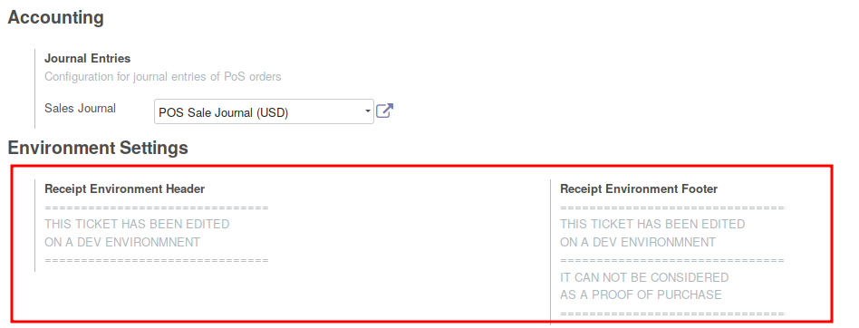

* Open your module ``server_environment_files``

* In each environment folder, create a new file named ``pos_environment.conf``
  (for exemple)

* In each file, write a section like this one, depending on your environment

.. code-block::

  [pos_environment_header]
  line_1 = ===============================
  line_2 = TICKET EDITED ON A TEST
  line_3 = ENVIRONMENT
  line_4 = ===============================

  [pos_environment_footer]
  line_1 = ===============================
  line_2 = THIS TICKET HAS BEEN EDITED
  line_3 = ON A TEST ENVIRONMENT
  line_4 = -------------------------------
  line_5 = IT CAN NOT BE CONSIDERED
  line_6 = AS A PROOF OF PURCHASE
  line_7 = ===============================

**Internationalisation**

If you deploy Odoo in a multi languages context, you can add a suffix
``__xx_xx`` in the name of each line, where ``xx_xx`` is the language.
The text will be displayed on the bill, depending of the language of the
current user. Sample :

.. code-block::

  line_1 = ===============================
  line_2__en_US = TICKET EDITED ON A TEST SERVER
  line_2__fr_FR = TICKET EDITE SUR SERVEUR DE TEST
  line_3 = -------------------------------

**Note**

To be sure that your server is correctly configured, you can check the settings
in the Point of Sale configuration.

