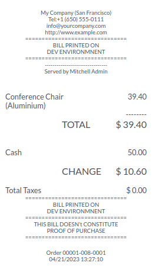

This module extends the Odoo point of sale module to allow administrator
to customize the bill printed by the point of sale, with a text depending
on your environment. (Development, , Pre Production, Production, etc...)

The displayed and printed bill will display the custom message

This module is based on the mechanism introduced by the ``server_environment``
module.

**Note**

This module provides a feature that is legally required in some countries
(such as France, under the law on accounting certification)
where test and production receipts must be distinguishable.
